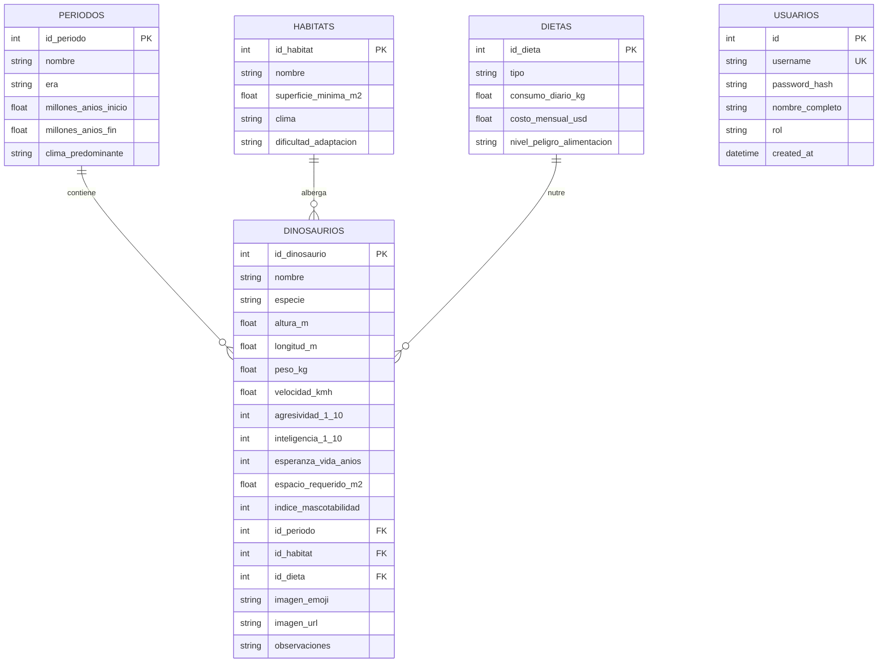

# Plan de Arquitectura e Implementación: DinoMascota Dashboard 🦖

Sistema integral de análisis, exploración multinivel y tablero de control para la evaluación de aptitud doméstica de dinosaurios, desarrollado para la cátedra de **Bases de Datos Aplicada (UAI — Ingeniería en Sistemas Informáticos)**.

---

## 1. Objetivos del Sistema y Alcance

Desarrollar una plataforma analítica interactiva y de toma de decisiones que permita:
1. Analizar más de **50 especies de dinosaurios** distribuidas en los períodos **Triásico, Jurásico y Cretácico**.
2. Evaluar mediante un **Índice de Mascotabilidad (0 a 100)** y una **Semaforización Visual de 3 Estados (Verde, Amarillo, Rojo)** la viabilidad de adopción y convivencia doméstica de cada espécimen.
3. Proveer navegación multidimensional mediante **Drill-Down / Drill-Up en 3 niveles** (Período ➔ Hábitat ➔ Especie ➔ Ficha Técnica).
4. Ofrecer herramientas analíticas avanzadas: **Buscador Dinámico Multifiltro**, **Comparador Cara a Cara (Head-to-Head)** y **Gráficos Estadísticos con Chart.js**.
5. Garantizar la seguridad mediante **Autenticación con contraseñas encriptadas en Bcrypt** almacenadas en SQLite y **Consultas SQL directas sin ORM**.

---

## 2. Modelo de Base de Datos y Entidades (SQLite)

El sistema implementa **5 tablas normalizadas en Tercera Forma Normal (3FN)**:

---

## 3. Arquitectura del Backend (FastAPI + SQL Puro)

Todos los endpoints ejecutan consultas SQL nativas (`SELECT`, `JOIN`, `GROUP BY`, `ORDER BY`, `CASE WHEN`):

| Endpoint | Método | Descripción Técnica |
| :--- | :---: | :--- |
| `/api/auth/login` | `POST` | Autenticación con verificación segura `bcrypt.checkpw()`. |
| `/api/stats/kpis` | `GET` | Agregaciones SQL (`COUNT`, `AVG`, `MAX`, `MIN`) para tarjetas de indicadores clave. |
| `/api/stats/drilldown/periodos` | `GET` | **Nivel 1:** Resumen por período geológico con conteo de especies y mascotabilidad promedio. |
| `/api/stats/drilldown/habitats/{id}` | `GET` | **Nivel 2:** Hábitats del período con métricas de espacio y especies disponibles. |
| `/api/stats/drilldown/dinosaurios/{p_id}/{h_id}` | `GET` | **Nivel 3:** Especies del hábitat con semáforo calculado en SQL (`CASE WHEN`). |
| `/api/stats/dinosaurio/{id}` | `GET` | Ficha técnica completa con `INNER JOIN` de las 4 entidades del dominio. |
| `/api/dinos/all` | `GET` | Catálogo completo ordenado alfabéticamente para selectores y listados. |
| `/api/stats/search` | `GET` | Buscador dinámico con filtros SQL (`LIKE`, id_periodo, id_habitat, id_dieta, semaforo). |
| `/api/stats/compare/{id1}/{id2}` | `GET` | Comparación biométrica y mascotabilidad lado a lado con veredicto automatizado. |
| `/api/stats/charts/*` | `GET` | Consultas agregadas para gráficos de dietas, períodos y top mejores/peores mascotas. |

---

## 4. Frontend SPA (React 18 + Tailwind CSS + Chart.js)

* **Dashboard General:** Visualización de KPIs y selector de vistas (Drill-Down, Catálogo Buscador, Comparador).
* **Navegación Drill-Down / Drill-Up:** Exploración jerárquica con migas de pan (*breadcrumbs*) y botón de retorno instantáneo.
* **Semaforización:** Códigos de color verde ($70-100$), amarillo ($40-69$) y rojo ($0-39$) aplicados en insignias, bordes y justificaciones.
* **Ficha Técnica Modal:** Ventana emergente con datos biométricos, requerimiento de espacio, costo mensual en USD y paleoarte.
* **Comparador Cara a Cara:** Selector dual con barras comparativas porcentuales y tarjeta del ganador.

---

## 5. Plan de Pruebas y Verificación

1. **Prueba de Autenticación:** Login exitoso para `admin` (`admin123`), `profesor` (`uai2026`) y `alumno` (`dino123`), y rechazo de credenciales inválidas.
2. **Prueba de Consultas SQL:** Validación de tiempos de respuesta menores a 50ms en SQLite para todas las rutas.
3. **Prueba de Carga de Imágenes:** Sincronización transparente de URLs paleoartísticas con fallback a emojis representativos.
4. **Prueba de Interfaz:** Responsividad en dispositivos móviles y de escritorio.
